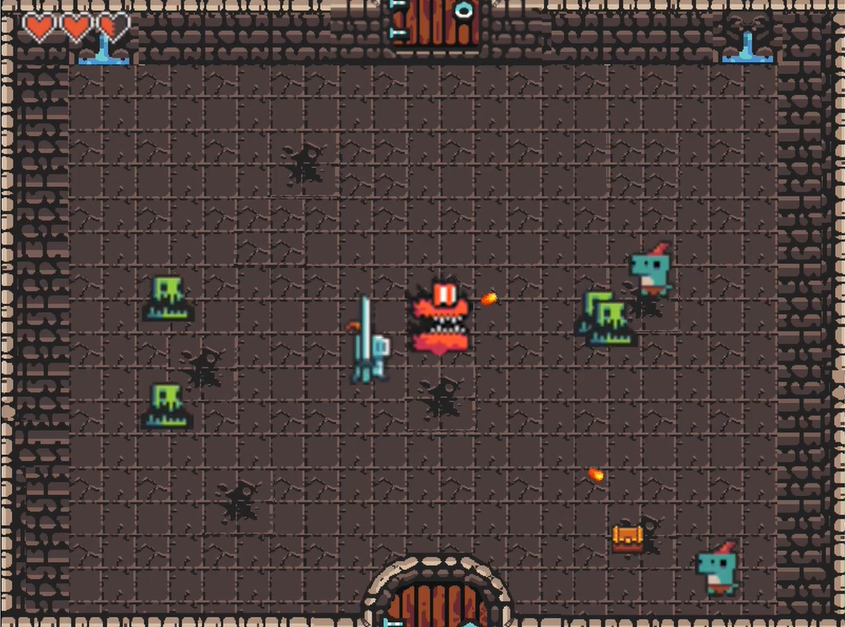
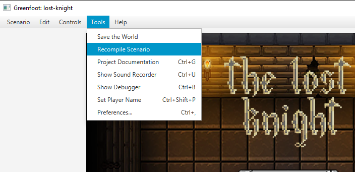

# About
This is a Greenfoot project made in 2023 to implement the object-oriented programming (OOP) concepts I had just learned in class.
The game features a selected variety of enemies and weapons; the gameplay is based on The Binding of Isaac and the first The Legend of Zelda game.

[Here is a video running the project.](https://youtu.be/e0CvzxY39Ac "Here is a video running the project")

  

## Requirements
- [Java](https://www.oracle.com/mx/java/technologies/downloads/ "Java") 17 or higher
- [Greenfoot](https://www.greenfoot.org/home "Greenfoot") installed

## Running the project
- Download the source code and decompress it on a folder.
- Open the _project.greenfoot_ file with Greenfoot.
- In order to run again the project click _Tools > Recompile Scenario_ 

  

## Credits
Thanks to [@SebastianMayG](https://github.com/SebastianMayG) and [@SantiagoGMG](https://github.com/SantiagoGMG) for working on the assets and the "final boss", and [@Luisalbertochinpro12](https://github.com/Luisalbertochinpro12) for designing the title screen.
